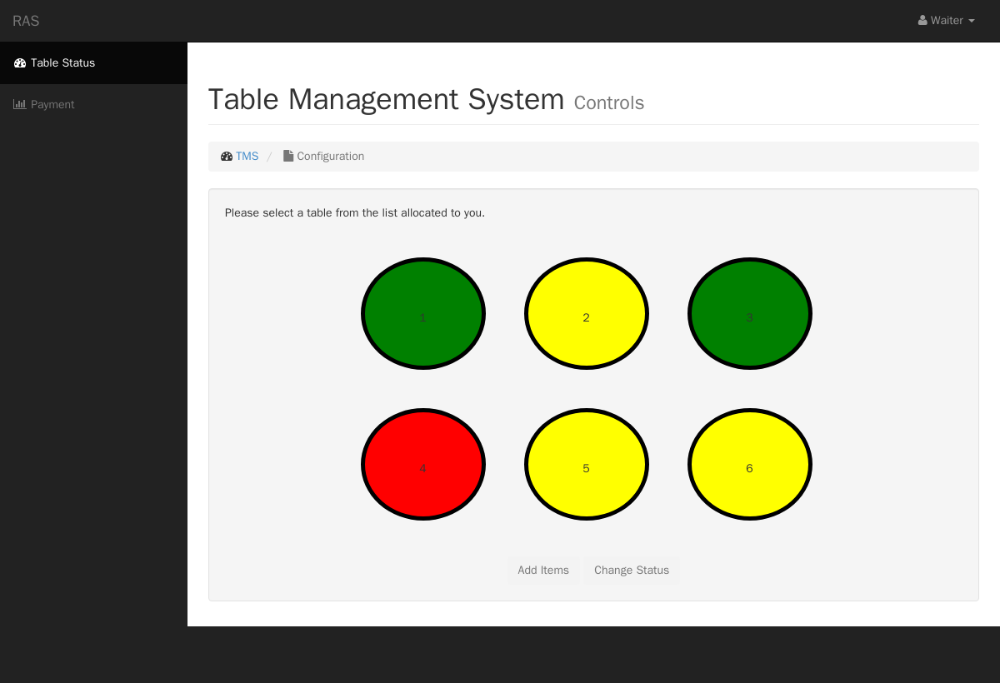

# Restaurant Management System — on NimbusCMS

The Restaurant Management System, **rebuilt as an application on
[NimbusCMS](https://github.com/NimbusCMS/nimbus)** instead of the original 2014
hand-rolled PHP. It runs a full restaurant — floor, orders, kitchen, payments,
staff roles, reservations, reports — plus a public site with online ordering, as a
Nimbus **plugin co-located in this repo** (`plugin/`) composed with the official
CRM (guests) and a theme (`theme/`). **Zero Nimbus core change** for app logic.

> The original 2014 version is preserved in **[`archive/`](archive/)** (and still
> runnable — see its README). This is the current system.

## Try the live demo

**<https://ras.nimbuscms.dev>** — a public sandbox that resets hourly.

- **Guests:** the homepage, the menu, and **online ordering** (`/order`) with a
  *simulated* checkout (no real payment).
- **Staff:** sign in at **`/admin`** — the login page has an *“Explore as …”*
  picker for each role. Every login uses the password **`restaurant-demo`**:
  `waiter@ras.demo` (floor), `cook@ras.demo` (kitchen), `manager@ras.demo`
  (everything + menu + guests), `admin@ras.demo` (the whole CMS), and more.

Signing in as a waiter vs. a cook vs. a manager shows the capability model live: a
cook has no payment button, a floor login can’t open a guest’s CRM record, and only
the manager sees Reports.

## Why this exists (platform validation)

Beyond the app, this rebuild is the **first real validation of Nimbus as a
platform**: if a whole restaurant can be built on Nimbus without pushing
restaurant-specific logic into the CMS core, the platform is proven. It drove two
reusable **core** capabilities — a read-only content capability for plugins
(ADR 0029) and fine-grained plugin capabilities (ADR 0030) — with nothing
restaurant-shaped added to core. The running ledger is in
[`docs/PLATFORM-VALIDATION.md`](docs/PLATFORM-VALIDATION.md); the architecture is in
[`docs/ARCHITECTURE.md`](docs/ARCHITECTURE.md) and
[`docs/adr/0001`](docs/adr/0001-restaurant-as-a-colocated-nimbus-plugin.md).

## Status — complete

- ✅ **Menu** — categories and priced items, as Nimbus collections.
- ✅ **Tables / floor** — `rest_table`, live status, mobile floor board (the RAS
  circular table tokens), capability-gated admin + MCP.
- ✅ **Orders** — open on a table, pick from the menu (snapshotting name + price),
  server-computed totals, workflow (ADR 0029).
- ✅ **Kitchen display** — a cook’s New → Preparing → Ready screen.
- ✅ **Payment & turn** — settle (server-computed amount), close, turn the table.
- ✅ **Staff & roles** — floor / kitchen / manage capabilities gate the terminals
  (ADR 0030).
- ✅ **Reservations** — a booking book linked to **CRM** guests by id, without the
  restaurant ever reading CRM data (the PII boundary holds).
- ✅ **Reports** — a manager dashboard (revenue, active orders, top items).
- ✅ **Public site** — a homepage (hero, about, live featured dishes, hours), the
  guest menu, and **online ordering** with a simulated checkout, in the dark RAS
  identity (`theme/`).
- ✅ **Deployed** — live at <https://ras.nimbuscms.dev>, resets hourly.

## Layout

```
plugin/            the restaurant plugin (type: nimbuscms-plugin)
  src/             RestaurantPlugin, Schema, Tables, Orders, Kitchen, Reservations,
                   Reports, admin pages, MCP toolset, online-order view-data + routes
  templates/       default templates for the public order page (theme-overridable)
  tests/           DB-backed test suites (run in CI)
theme/             the public "RAS" theme (homepage, menu, order pages)
app/collections.php  the menu content model, declared as data
bin/provision-menu.sh  installs the menu onto a running Nimbus via its public API
deploy/            deploy kit — DEPLOY.md runbook, seed-demo.php, reset scripts, demo logins
docs/              ARCHITECTURE, PLATFORM-VALIDATION, ADRs, per-slice design docs
archive/           the original 2014 app (unmodified; runnable via Docker)
```

## Run it locally

The app is a Nimbus **plugin**; a site consumes it via a Composer **path
repository** (Nimbus discovers plugins by `type: nimbuscms-plugin`), alongside the
CRM and the theme. The full, reproducible recipe — a Docker image built from a
Nimbus base + this repo’s `plugin/` + the CRM + the `theme/`, then migrate + seed —
is documented in **[`deploy/DEPLOY.md`](deploy/DEPLOY.md)**, and the demo data
(roles, one login per role, the menu, sample floor/orders/reservations) is created
by **[`deploy/seed-demo.php`](deploy/seed-demo.php)**.

In short:

1. Build a site image: the Nimbus base image, plus `composer require danmat/restaurant`
   (via a path repo pointing at this repo’s `plugin/`) and `nimbuscms/crm`, and copy
   `theme/` into the site’s `themes/restaurant/`. (See `deploy/DEPLOY.md`.)
2. Bring up the app + a MySQL, then:
   ```bash
   php bin/nimbus migrate
   php bin/nimbus install --email=admin@ras.demo --password=<a strong password> --name="RAS Admin"
   php deploy/seed-demo.php     # roles, logins, menu, sample data
   ```
3. Visit `/` (homepage), `/menu_items` (menu), `/order` (online ordering), and
   `/admin` (staff).

Just the **Menu** vertical against an already-running Nimbus:

```bash
NIMBUS_URL=http://localhost:8080 \
ADMIN_EMAIL=admin@nimbus.test ADMIN_PASSWORD=password \
  bin/provision-menu.sh
```

## The original 2014 app

Preserved in [`archive/`](archive/) — procedural PHP + Bootstrap 3. It wouldn’t
start on a modern PHP (it uses the removed `mysql_*` extension), so it ships with a
Docker setup that runs it authentically on PHP 5.6:

```bash
cd archive && docker compose up --build   # then http://localhost:8090
```

The waiter's floor from the 2014 app — the original circular table tokens that the
rebuild's RAS uplift brought back:


