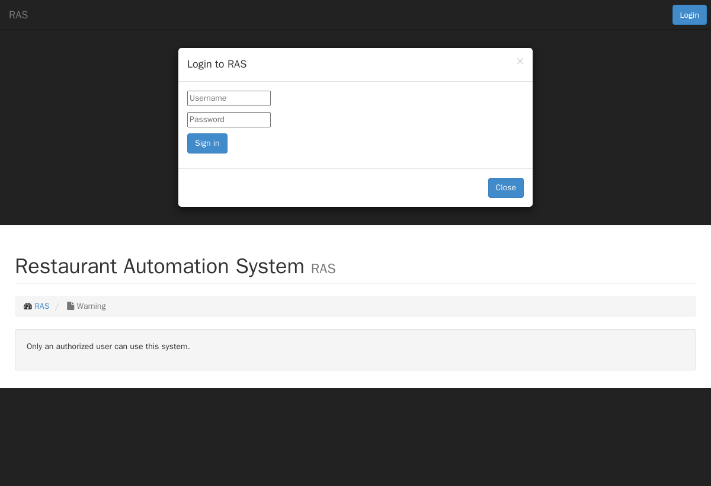

> # 🗄️ Archive — the original 2014 version
>
> This folder is the **origin of the project**: the Restaurant Management System as
> it was first written in **2014** (procedural PHP + the long-removed `mysql_*`
> extension + Bootstrap 3). It is kept **unmodified** for posterity — it is *not*
> the current app.
>
> The project has since been **rebuilt as an application on
> [NimbusCMS](https://github.com/NimbusCMS/nimbus)**. For the current system, see
> the [repository root README](../README.md).
>
> **Concessions to age (no app logic changed):** `includes/settings.inc.php` reads
> its DB host from environment variables (original values kept as the fallback) so it
> can reach the database container; and the Docker image restores the 2014
> shared-hosting PHP defaults the code assumes — `output_buffering` on (so its
> `session_start()`/`header()` calls after page output still work, which is the real
> reason it "wouldn't start" on a modern default config) and errors hidden as on a
> production host. The application source itself is untouched.

## Run the original app (Docker)

It wouldn't start on a modern PHP because it calls the `mysql_*` functions removed
in PHP 7. The included Docker setup runs it authentically on **PHP 5.6 + MySQL 5.7**:

```bash
cd archive
docker compose up --build
```

Then open <http://localhost:8090> and sign in. Stop it with `docker compose down`
(add `-v` to also drop the database).

### It runs — proof

The login screen, and the waiter's floor after signing in — the original signature
**circular table tokens** (green = open, yellow = occupied, red = needs bussing)
that the rebuilt app's RAS uplift brought back:




---

# Restaurant-Management-System
A restaurant management system based on PHP

Restaurant Management System was developed using PHP as backend and Bootstrap as frontend. The system allows the waiter to take orders/payments from customers and maintain table status. The cook can see the list of orders made by different waiters and notify the same once the food is prepared. The system allows the manager to see the monthly revenue of the restaurant and the inventory. The admin user can maintain the different roles of the system.

Credentials

Username: waiter

Password: 123


Username: cook

Password: 123


Username: host

Password: 123


Username: busboy

Password: 123


Note: includes/settings.inc.php has the DB connection settings.

oose.sql has the sample DB
